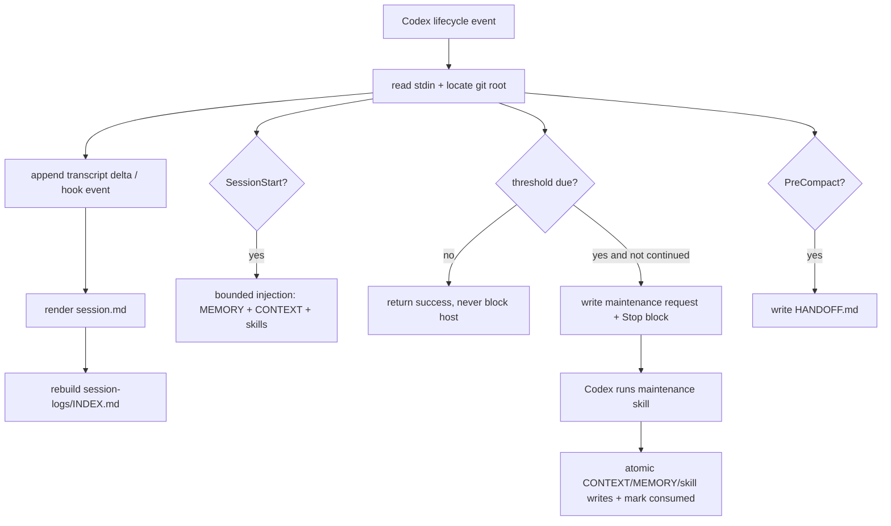

## 0. 术语约定

| 术语 | 定义 | 防冲突结论 |
|---|---|---|
| 原始会话源 | Codex hook 输入中的 `transcript_path` 字节和无法读取 transcript 时保留的 hook 事件 | 它是归档的唯一权威来源；`session.md`、索引、摘要都可重建 |
| 确定性层 | 不调用模型的归档、去重、渲染、索引、迁移、注入和节流逻辑 | 失败不能阻塞 Codex 原操作，必须保留原始数据并写诊断 |
| 维护轮次 | 由 Stop hook 触发的 Codex 继续轮次，用当前 Codex 模型执行 consolidation/autolearn | 不在 hook 中嵌套调用另一个模型 API，避免破坏 Codex 会话语义 |
| 项目状态 | `<git-root>/.agents/memory/` 下的 `MEMORY.md`、`CONTEXT.md`、`HANDOFF.md`、索引和节流文件 | 与 Pi v0.1.2 保持可迁移的路径和字段；Codex 私有控制字段另放 state 文件 |

## 1. 决策与约束

### 需求摘要

为当前 Pi 项目上下文插件提供 Codex Desktop 可安装的本地插件包，保留最重要的数据流：会话事件 → 原始日志 → Markdown/索引 → 项目记忆与工作上下文 → 下一轮注入，并能导入已有 Pi 会话和旧布局。成功标准是：在一个临时 Git 项目中用 hook fixture 跑完启动、用户提交、工具完成、压缩、停止、结束事件后，原始数据可逐字节追踪、重复事件不重复写入、`CONTEXT.md`/`MEMORY.md`/`INDEX.md` 可观察，下一次 SessionStart 能注入有上限的上下文。

明确不做：

1. 不修改或删除现有 Pi extension 的行为、路径和测试。
2. 不把 Codex 不稳定的 transcript 内部格式当成公共 schema；解析失败时保留原始内容和 hook 记录。
3. 首版不从 hook 自动创建/切换新的 Codex Desktop task；只生成 `HANDOFF.md`，并提供手动维护 skill。手动 smoke test 会明确区分同 task 的 PostCompact 与用户新建 task 后的 SessionStart。
4. 不默认上传会话、记忆或项目文件到外部服务；模型维护使用当前 Codex 继续轮次。

### 复杂度档位

走“跨运行时数据迁移 + 生命周期 hook + 长期本地资产”默认档位，无额外偏离。

### 关键决策

1. **插件边界**：在 `Projects/` 下建立独立项目 `codex-project-context/` 作为 Codex 插件源，不复制 Pi extension，也不让 Codex hook import Pi 运行时。这样 Codex 插件可独立安装、升级和卸载，运行期仍把状态写入使用它的项目。
2. **数据源优先级**：每个 Codex session 的 `session.jsonl` 采用 append-only envelope；hook 读取 transcript 的新增字节并保留原文，无法读取时追加结构化 hook event。渲染器只消费这份本地源，不消费 `CONTEXT.md` 反推历史。
3. **模型调用位置**：归档和注入必须同步、无模型；达到阈值时 Stop hook 只创建一次维护请求并用 `decision:block` 要求 Codex 继续执行维护 skill。这样复用当前会话模型和权限，不引入 API key 或后台嵌套 Codex。
5. **Desktop 差异**：`handoffEnabled` 仍记录配置，但自动 handoff 只写 `HANDOFF.md` 并在下一轮注入提示；新 task 的创建由用户操作，避免依赖未承诺的 Desktop API。

迁移边界：`.pi/MEMORY.md`、`.pi/CONTEXT.md`、`.pi/session-logs/`、`.pi/skills/`、`.agents/memory/skills/`、`.agents/memory/session-index.md` 和 OMP project memory 都作为源输入；文件不存在则跳过。目标不存在时复制，目标和源都是目录时逐项合并；同字节文件跳过；内容不同的源文件复制为 `<target>.legacy-<source-sha256-12>`，并在 `.agents/memory/migration-manifest.json` 记录 source、target、sha256 和状态；文件/目录类型冲突两侧都保留并写冲突项。Codex 迁移不删除源，重复运行由 manifest 中的 source sha256 去重；源内容变化会产生新的旁车证据，不覆盖旧证据。

迁移只对每个实际复制的普通文件计算一次内容 `sha256`，用于冲突旁车命名和 manifest 幂等；不计算目录树 digest，也不把 hash 当作安全认证。目录遍历使用稳定的相对路径排序，类型冲突两侧保留，源文件不删除。

### 基线风险与证据计划

- 最高风险是 transcript 格式变化：用字节游标 + 不透明原文保存、无格式解析也能通过归档验收。
- 第二风险是 Stop 继续轮次循环：维护请求带 session/turn 标识，`stop_hook_active` 或已消费标记会使同一轮直接放行。
- 第三风险是 Pi 数据迁移误删：迁移前后做清单与字节摘要，冲突不覆盖、不删除，所有失败写 `errors.log`。
- 非显然依赖：Codex 必须允许插件 hook 且脚本运行环境有 Python 3；阻塞 hook 验证和 Desktop 安装验收，但不阻塞纯归档单测。
- 证据类型：Python 单元/fixture 测试证明数据变换；hook 合约测试证明 stdin/stdout；插件校验器证明清单；临时 Git 项目手工验证 Desktop 生命周期。

## 2. 名词与编排

### 2.1 名词层

**现状**：Pi v0.1.2 已把 `archive.ts`、`session-log.ts`、`session-index.ts`、`import-archive.ts`、`consolidate.ts`、`autolearn.ts`、`handoff.ts` 分层，持久化根为 `<project>/.agents/memory/`，辅助模型路由也已统一。

**变化**：新增 Codex 插件适配层，提供以下稳定契约：

```text
HookEvent(stdin JSON) -> { project_root, session_id, event, transcript_path }
  -> append_session_source() -> render_session() -> rebuild_index()
  -> maybe_inject() / maybe_request_maintenance()
```

- `session.jsonl`：Codex 侧是 append-only JSONL envelope，每行包含 `kind`、`session_id`、`event`、`source_path`、`source_identity`、`from`、`to` 和 `payload_b64`。`payload_b64` 保留 transcript 的任意原始字节，不把不稳定格式重新解释成 Pi 类型；hook 输入以 `kind=hook-event` 保存。Pi 导入记录使用 `kind=pi-import`，原文件字节仍在 `payload_b64` 中。
- `session-state.json`：每个 session 的游标状态，保存 transcript 路径、设备/inode、上次全文件 sha256、已消费前缀 sha256、已消费字节数和最后 envelope id。路径变化、inode 变化、文件变短或同长度全文件摘要变化时追加 `source-reset` envelope 并从 0 重新读取，不覆盖旧数据。
- `CONTEXT.md`：工作态摘要，整体重写；`MEMORY.md`：跨会话事实，只有维护轮次明确晋升才改写。
- `maintenance-request.json`：一次维护请求的 `request_id`、session/turn、材料摘要、触发原因和状态 `pending|consumed|failed`；消费和状态更新都用原子 rename，阻止 Stop 循环。
- `project-context.json`：沿用 Pi 配置 key；新增 `codexHookEnabled: true`、`maintenanceMode: "stop-continuation"`、`maxInjectedChars: 12000`；项目文件优先于插件默认值，无文件时使用这些默认值。

指纹规则固定为三种：transcript state 保存一次当前全文件 sha256 和一次已消费前缀 sha256，用于判断“追加 / 重写”；原始 chunk 只计算一次 payload sha256，作为 chunk 去重 key；hook event 对规范化事件 JSON 计算一次 event sha256，作为事件去重 key。hash 仅用于内容变化、去重和迁移幂等，不承担安全认证。

输入 → 输出示例：

```text
SessionStart(cwd=/repo, session_id=s1)
  -> additionalContext: bounded MEMORY.md + CONTEXT.md + active skill paths

PostToolUse(transcript_path=t, same session)
  -> session.jsonl: one envelope containing bytes after cursor(t), base64 encoded

Stop(turn=same, stop_hook_active=false, threshold reached)
  -> atomically create request_id(session, turn, material digest)
  -> decision=block, reason="Run project-context maintenance skill once for request <id>."
  -> maintenance-request.json

Stop(turn=same, stop_hook_active=true or request already pending/consumed)
  -> empty success; no second continuation
```

Codex hook 装载契约：使用插件根目录默认发现的 `hooks/hooks.json`，`plugin.json` 不写 `hooks` 字段，以保持脚手架校验兼容。命令统一为 `python3 \"$PLUGIN_ROOT/hooks/context_hook.py\"`；`PLUGIN_ROOT` 由 Codex 注入。事件配置采用 `SessionStart` 的 `startup|resume|clear|compact`、`PreCompact`/`PostCompact` 的 `manual|auto` matcher，其余事件不配置 matcher。

事件响应契约：`SessionStart` 返回 `hookSpecificOutput.additionalContext` 或空成功；`UserPromptSubmit` 只返回追加上下文或空成功；`PostToolUse`/`PreCompact`/`PostCompact`/`SessionEnd` 不阻塞宿主且只返回诊断可见的 `systemMessage`；`Stop` 成功时返回空 JSON，只有新建 pending request 时返回 `{\"decision\":\"block\",\"reason\":...}`。脚本遇到异常写 `errors.log` 后退出码为 0。

Stop request 的可观察状态转换：首次满足阈值且 `stop_hook_active=false` 时，先以临时文件原子创建 `pending` request，再输出 `decision:block`；同 session/turn 的再次 Stop、`stop_hook_active=true` 或已有 pending/consumed request 只返回 `{}`；维护 skill 成功写完目标文件后把同一 request 标成 `consumed`；模型输出非法、文件写失败或用户中断则标成 `failed` 并保留材料，手动重试生成新的 attempt id，不复用旧 request。重启只恢复 pending/failed 供 skill 查看，不自动触发新的 Stop block。

维护 skill 使用版本化 schema `schema: "project-context/2"` 的两个明确输出对象。consolidation 的 top-level required 且唯一 key 集合是 `{schema,memory_markdown,context}`；`memory_markdown` 为字符串且 ≤24000 字符，`context` 的 required 且唯一 key 集合是 `{title,summary,key_points,open_tasks}`（title ≤160、summary ≤6000、两个数组均为字符串且最多 50 项）。autolearn 的 top-level required 且唯一 key 集合是 `{schema,active_skills,skill_candidates}`；两数组元素的 required 且唯一 key 集合是 `{name,markdown,evidence_session_ids}`，name 必须是小写连字符 slug，active 每项至少引用 2 个已归档 session，candidate 至少引用 1 个。未知 schema、未知字段、缺字段、错误类型、JSON 之外的回答或超出大小限制都不写 MEMORY/active skill；候选只写 `skill-candidates/<name>.md`。所有目标文件先写临时文件、校验大小和标题，再原子替换；状态最后才变为 `consumed`。

### 2.2 编排层

**现状**：Pi 以 `session_start`、`before_agent_start`、`turn_end`、`agent_settled`、`session_shutdown` 直接调用各功能模块，归档、整理、沉淀和 handoff 共用项目状态；Codex 提供 `SessionStart`、`UserPromptSubmit`、`PostToolUse`、`PreCompact`、`PostCompact`、`Stop`、`SessionEnd` 等命令 hook，但 transcript 格式不是稳定接口。

**变化**：Codex 侧采用“确定性归档 DAG + 可选维护轮次”拓扑：



Pi → Codex 生命周期映射：

| Pi 事件 | Codex 事件 | 关系 | 变化 |
|---|---|---|---|
| `session_start` | `SessionStart` | 等价 | 迁移、初始化、注入 |
| `before_agent_start` | `UserPromptSubmit` + `SessionStart` | 降级映射 | Codex 用追加开发者上下文，不拦截或改写用户 prompt |
| `turn_end` | `PostToolUse` + `Stop` | 近似映射 | 工具后增量归档，Stop 做 settle/阈值判断；无单一 turn_end 事件 |
| `agent_settled` | `Stop` | 近似映射 | 依赖 `last_assistant_message` 和 transcript，不读取 Pi session manager |
| `session_shutdown` | `SessionEnd` | 等价 | 最后归档和索引 |
| Pi compaction/handoff | `PreCompact` + `PostCompact` | 降级映射 | 写 `HANDOFF.md` 并注入指针，不自动创建新 task |

流程级约束：

- 任何文件失败都捕获并写 `errors.log`，hook 退出成功，不阻塞原始用户提示、工具调用或压缩；唯一例外是 Stop 维护请求的显式继续。
- 任何 transcript 原始字节都以 base64 envelope 追加；同一路径通过 `source_identity=(resolved path, dev, ino)`、一次全文件 sha256、一次已消费前缀 sha256 和 offset 游标判断追加或重写。文件追加时验证旧前缀摘要；同 inode 同长度原地改写会 reset。文件被重写、截断或 inode 改变时追加 reset envelope，再从 0 读新源。
- 每个 session 的 append/state/rebuild 在同一个 POSIX `flock` 锁内完成；Stop request 使用同一项目锁加 `O_CREAT|O_EXCL` request 文件。写 envelope 先 flush+fsync，再提交 cursor；崩溃恢复时截断不完整尾行到最后换行并重新读取未提交 offset，若最后完整 envelope 的 deterministic id 已存在则只补交 cursor，不重复追加。并发 fixture 必须同时覆盖两个 hook writer 和两个 Stop writer。
- `session.md` 和 `INDEX.md` 可由原始日志重建；写入使用临时文件加原子 rename。
- 维护轮次状态机为 `absent -> pending -> consumed|failed`；`request_id=session_id + turn_id + offset`，不额外计算安全摘要。同一 request 只能原子消费一次；重启发现 pending 不自动重复 block，而由手动维护 skill 重试并记录新的 attempt；失败不覆盖长期记忆。
- 注入内容有字符上限，按 `CONTEXT.md` → `MEMORY.md` → active skill 指针的顺序取完整 UTF-8 字符数；单文件超限按行裁剪，空文件跳过，任何被裁剪文件追加相对路径指针。
- `SessionEnd` 只做最后一次归档与索引，不依赖异步任务完成；异步维护未完成也不丢原始日志。

### 2.3 挂载点清单

1. `codex-project-context/.codex-plugin/plugin.json`：Codex 插件清单。
2. `codex-project-context/hooks/hooks.json`：生命周期 hook 注册。
3. `codex-project-context/hooks/context_hook.py`：hook stdin/stdout 适配入口。
4. `codex-project-context/skills/project-context-maintenance/SKILL.md`：维护轮次与手动修复流程。
5. 现有仓库下的 `.agents/memory/`：运行期项目状态；不新增全局数据库或远端存储。

### 2.4 推进策略

1. **编排骨架**：完成插件清单、默认 hook 注册、Pi→Codex 映射和失败隔离；逐事件 fixture 能返回合法响应。
2. **原始源 framing**：实现 envelope、base64 原始字节、source identity、offset/reset 状态；任意字节和重复/重写源有证据。
3. **渲染与索引**：从 envelope 重建 `session.md`、机械索引和 `.gitignore`；无模型、原子写入。
4. **迁移节点**：复制/合并 Pi `.pi`、旧 skills、旧 index、OMP 数据，验证幂等、冲突保留和不删除源目录。
5. **注入节点**：实现配置默认值、SessionStart/UserPromptSubmit 有界注入和裁剪指针。
6. **Stop/handoff 节点**：实现 request 状态机、防循环、PreCompact HANDOFF 和 PostCompact/新 task 的路径说明。
7. **模型维护节点**：提供 consolidation、autolearn、候选技能的输出 schema、证据门槛、原子写入和失败重试 skill。
8. **验证与交付**：补齐 fixture/迁移回归测试，运行 Pi 基线、插件校验，并在临时 Git 项目做两种 Desktop smoke test。

### 2.5 结构健康度与微重构

##### 评估

- 文件级 — 现有 `extensions/project-context/*.ts`：部分 handoff/autolearn 文件较大，但本 feature 不修改它们；职责边界已由 Pi v0.1.2 拆开。
- 目录级 — 新插件目录不存在；将按 `hooks/`、`scripts/`、`skills/`、`tests/` 分层，不把 hook、迁移和模型维护混在一个脚本中。
- 接口级 — Codex hook 是外部边界，适配器保留 stdin/stdout seam；核心状态逻辑可在无 Codex 进程的 fixture 中测试。

##### 结论：不做

本 feature 不做 Pi 源码重构，也不为新插件预先做纯搬运；若实现中发现 Pi 模块需要改签名或重划职责，另开 `cs-refactor`，不混入迁移。

## 3. 验收契约

### 3.1 关键场景清单

1. 空项目启动：SessionStart → 不报错，创建项目状态目录，输出不超过配置上限的上下文。
2. 完整事件流：同一 session 的启动、用户提交、工具完成、压缩前后、停止、结束 → envelope 有序追加，`session.md` 和 `INDEX.md` 可重建，SessionEnd 再 flush 不重复。
3. 原始 framing：任意 UTF-8/非 UTF-8 字节、重复 offset、两个 writer 并发、同 inode 同长度原地改写、文件重写/inode 变化 → base64 可逆，reset 可追踪，不重复追加或覆盖旧源。
4. transcript 不可读：路径缺失或格式未知 → 保留 hook 输入，写 `errors.log`，不阻塞 Codex。
5. Pi 迁移：已有 `.pi`、旧 `.agents/memory/skills`、旧 index 或 OMP 数据 → 新路径可读，第二次运行无重复，源不被删除，类型冲突两侧保留。
6. 启动注入：已有 `MEMORY.md`、`CONTEXT.md`、skill → SessionStart 返回按固定优先级、有字符上限的附加上下文；空文件、超长单文件、多 skill 都有边界结果。
7. 维护节流：达到轮次/时间阈值 → 两个并发 Stop 最多创建一个唯一 pending request；继续轮次、重复 Stop、进程重启、维护失败均不循环且状态可恢复。
8. 维护结果：符合 `project-context/2` 的 consolidation/autolearn 输出 → 原子更新目标文件；未知 schema/非法 JSON/缺字段不覆盖 `MEMORY.md`；少于 2 个已存档 session 时只写候选技能。
9. 压缩交接：PreCompact → 生成包含旧 session id、项目、索引指针和待办的 `HANDOFF.md`；同 task PostCompact 只重注入，用户手动新 task 后 SessionStart 能看到指针。
10. 兼容保守：不配置外部 API key、不安装 Pi runtime → 插件仍能完成归档、索引、注入和手动维护协议。

明确不做的反向核对：代码中不得依赖 Pi `ExtensionAPI`、不得在 hook 中调用远端模型 API、不得调用创建/切换 Desktop task 的未定义接口、不得在 Codex 迁移时无条件删除 `.pi`/旧 skills/OMP 源目录；测试报告里的正常输出不属于运行期 debug 输出。

### 3.2 Acceptance Coverage Matrix

| Scenario | Covered By Step | Evidence Type | Command / Action | Core? |
|---|---|---|---|---|
| 空项目启动与有界注入 | S1 / S5 | hook 合约测试 | `python3 -m unittest discover -s plugins/codex-project-context/tests -p 'test_*.py' -v` | yes |
| 事件流归档、渲染、索引、SessionEnd flush | S2 / S3 | fixture 测试 + 文件检查 | `python3 -m unittest discover -s plugins/codex-project-context/tests -p 'test_*.py' -v` | yes |
| framing、重复 offset、重写源、任意字节 | S2 | fixture 测试 | `python3 -m unittest discover -s plugins/codex-project-context/tests -p 'test_*.py' -v` | yes |
| 两个并发 writer 与两个并发 Stop 的 exactly-once | S2 / S6 | 并发 fixture 测试 | `python3 -m unittest discover -s plugins/codex-project-context/tests -p 'test_*.py' -v` | yes |
| fsync 后 cursor 提交、尾行恢复、envelope 重放和 O_EXCL 故障注入 | S2 / S6 | 故障注入 fixture | `python3 -m unittest discover -s plugins/codex-project-context/tests -p 'test_*.py' -v` | yes |
| 不可读 transcript 与 errors.log | S2 | fixture 测试 | `python3 -m unittest discover -s plugins/codex-project-context/tests -p 'test_*.py' -v` | yes |
| Pi 数据迁移、幂等、冲突与源保留 | S4 | 迁移回归测试 | `python3 -m unittest discover -s plugins/codex-project-context/tests -p 'test_*.py' -v` | yes |
| 注入优先级、字符预算和裁剪指针 | S5 | hook 合约测试 | `python3 -m unittest discover -s plugins/codex-project-context/tests -p 'test_*.py' -v` | yes |
| Stop request 状态机与防循环 | S6 | hook 合约测试 | `python3 -m unittest discover -s plugins/codex-project-context/tests -p 'test_*.py' -v` | yes |
| 非法维护结果、证据门槛和原子写入 | S7 | 状态/文件 diff | `python3 -m unittest discover -s plugins/codex-project-context/tests -p 'test_*.py' -v` | yes |
| PreCompact/PostCompact 与新 task handoff 指针 | S6 / manual | fixture + 手工 | `python3 -m unittest discover -s plugins/codex-project-context/tests -p 'test_*.py' -v` + 两种 smoke | yes |
| 无外部 API key/Pi runtime 仍可归档和注入 | S1 / S2 / S5 | clean-env fixture | `env -u OPENAI_API_KEY python3 -m unittest discover -s plugins/codex-project-context/tests -p 'test_*.py' -v` | no |
| Desktop 插件装载和 hook 信任后执行 | S1 / S8 | 插件校验 + 手工 smoke | `validate_plugin.py plugins/codex-project-context` + 新建临时 task | yes |

### 3.3 DoD Contract

| ID | 要求 | 证据 | 阻塞级别 |
|---|---|---|---|
| DOD-DESIGN-001 | design、checklist、design-review 通过且术语一致 | design review | blocking |
| DOD-IMPL-001 | 所有 checklist step 完成，运行期产物和测试落盘 | checklist + test output | blocking |
| DOD-REVIEW-001 | 独立代码审查通过，无未解决 blocking finding | review report | blocking |
| DOD-QA-001 | 核心场景和必跑命令通过 | QA report | blocking |
| DOD-ACCEPT-001 | 临时项目 smoke 通过，交付物与不做项反查通过 | acceptance report | blocking |

Validation Commands：

| ID | 命令 | 目的 | 核心性 | 失败处理 |
|---|---|---|---|---|
| CMD-001 | `node tests/run-all.mjs` | Pi 基线回归 | yes | 区分既有红灯与本次引入 |
| CMD-002 | `python3 -m unittest discover -s plugins/codex-project-context/tests -p 'test_*.py' -v` | Codex hook/迁移/数据流测试 | yes | 修复或阻塞，不跳过核心场景 |
| CMD-003 | `python3 /home/user/.codex/skills/.system/plugin-creator/scripts/validate_plugin.py plugins/codex-project-context` | 插件清单与结构校验 | yes | 修复 manifest/目录 |

## 4. 与项目级架构文档的关系

当前仓库没有 `requirements/CONTEXT.md`、ADR 或现有 feature 设计可供继承；本方案把 Pi v0.1.2 的 README、源码与测试作为行为基线。实现通过后，如用户继续维护两种宿主的共同数据格式，再单独创建 ADR/compound 记录“确定性归档层与宿主适配层分离”，本 feature 不提前伪造架构决策。
